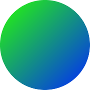

<p align="center"></p>

<h1 align="center">Gradient Avatar</h1>

<p align="center">🌈 Beautiful default avatars.</p>
<p align="center">
  <a href="https://travis-ci.org/EezyQuote/gradient-avatar">
    
  </a>
  <a href="https://codecov.io/gh/EezyQuote/gradient-avatar">
    
  </a>
</p>

## About

Generate beautiful and unique avatars for your users. `gradient-avatar` was inspired by Vercel.

## Install

```
$ npm install gradient-avatar
```

## Usage

```js
const avatar = require('gradient-avatar')

avatar('uid')
// => the avatar svg
```

## API

### avatar(seed[, size])

#### seed

Type: `string`

The seed for the generated avatar.

#### size

Type: `number` | `string`

The generated svg's size. Number default to `px` string required a measurement unit.

#### Returns

Type: `string`

The generated avatar svg.

## License

MIT © EezyQuote
